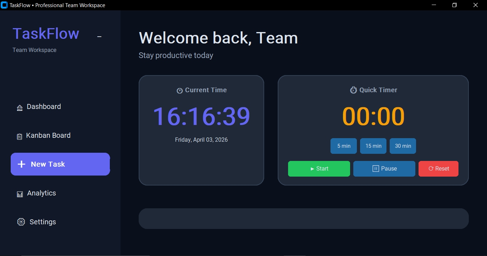

Welcome Developers,

# TaskFlow - Professional Team Task & Productivity Manager


A modern, beautiful, and fully functional desktop application built with **CustomTkinter** to help individuals and teams stay organized, focused, and productive.

---

## ✨ Features

### Core Functionality
- **Interactive Kanban Board** – Drag-and-drop style task management with three columns: To Do, In Progress, Done
- **Smart Task Management** – Create, edit, and delete tasks with rich details
- **Priority System** – Color-coded priorities (High - Red, Medium - Orange, Low - Green)
- **Subtasks & Checklists** – Add dynamic checklists inside each task
- **Due Date Tracking** – Visual due date indicators with overdue highlighting

### Productivity Tools
- **Built-in Pomodoro Timer** – Professional focus timer with automatic time logging to tasks
- **Real-time Notifications** – Elegant popup notifications for session completion and reminders
- **Comprehensive Analytics** – Export weekly reports in both **CSV** and **professional PDF** formats

### Beautiful & Modern UI
- Sleek dark-themed interface with premium glassmorphism-style cards
- Consistent professional typography and spacing
- Smooth hover effects and clean button design
- Fully responsive layout

### Technical Excellence
- Persistent SQLite database with proper error handling
- Comprehensive logging system
- Configurable via `config.json`
- Clean OOP architecture with modular design
- Input validation and user-friendly error messages

---

## 🖥️ Screenshots



---

## 🚀 Installation & Setup

### Prerequisites
- Python 3.8 or higher

### Steps

1. **Clone or download** the project
2. **Install dependencies**:
   ```bash
   pip install customtkinter pandas reportlab
